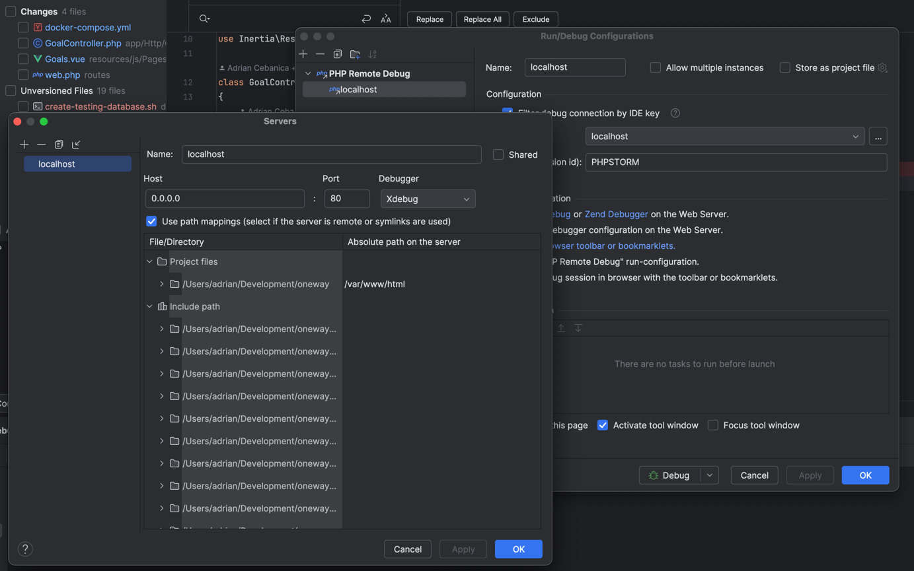

## URL
https://goaltracker.co

## Local Setup (docker)

1. Install docker
2. Install composer
3. `cp .env.example .env`
4. Run `./vendor/bin/sail up`
5. `./vendor/bin/sail artisan key:generate`
6. Run migrations `./vendor/bin/sail artisan migrate --seed`
7. Run npm ci `./vendor/bin/sail npm ci`
8. Run npm watcher `./vendor/bin/sail npm run dev`

## xDebug Settings

